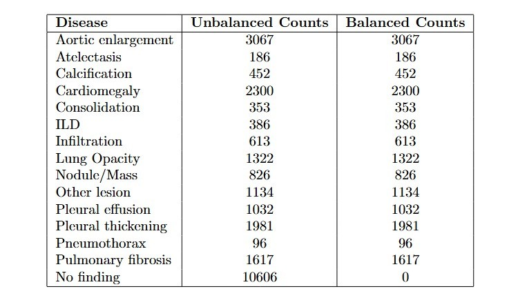
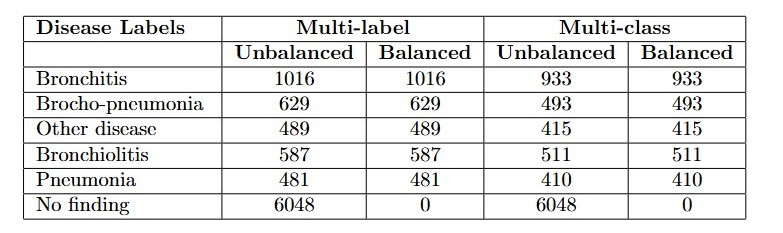
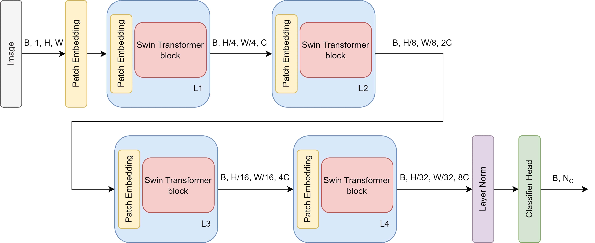
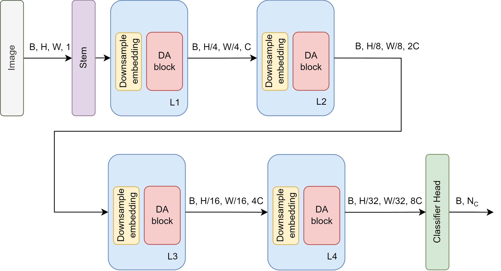
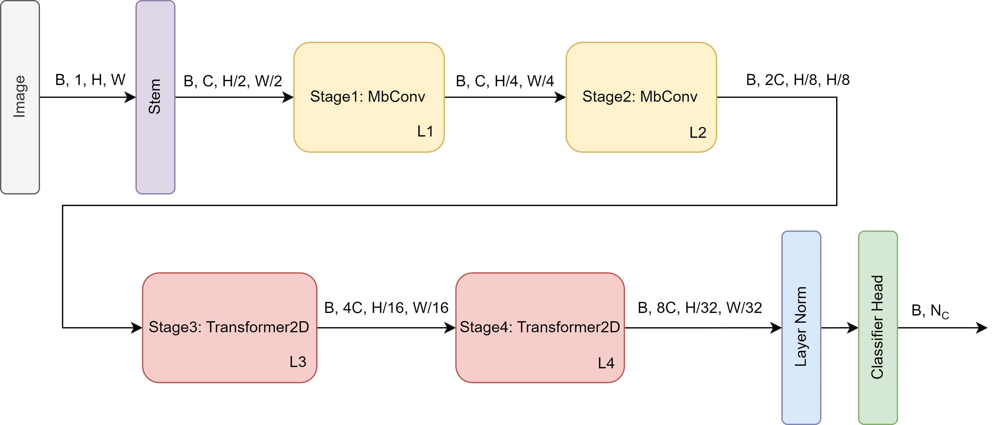
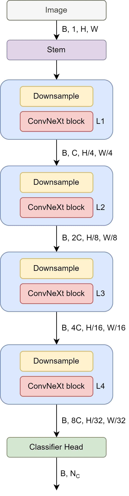
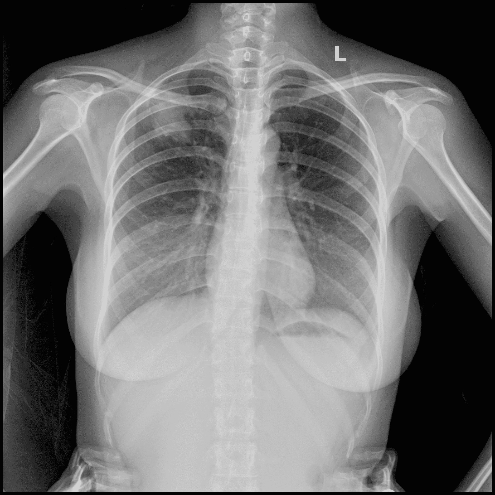

# Comparative Analysis of CNNs vs. Vision Transformers on Chest X-Rays

## 📄 Abstract
This project conducts a comprehensive comparative analysis of **Convolutional Neural Networks (CNNs)** and **Vision Transformers (ViTs)** for the classification of thoracic diseases. Using the **VinDr-CXR (Adult)** and **VinDr-PCXR (Pediatric)** datasets, we evaluated state-of-the-art architectures including **ResNet, EfficientNet, ConvNeXt, Swin Transformer, and CoAtNet**.

Our findings indicate that while CNNs (like CoAtNet) excel in capturing fine-grained local features, Vision Transformers (like Swin) offer superior performance in modeling long-range dependencies, achieving competitive AUC scores across both multi-label and multi-class tasks.

---

## 🚀 Key Results

We implemented a robust training pipeline including **CLAHE preprocessing** and **Albumentations** for data augmentation.

### 1. Adult Dataset (VinDr-CXR) - Multi-Label
| Model | Accuracy | AUC | Precision |
| :--- | :--- | :--- | :--- |
| **Swin Transformer** | **95.22%** | **0.9328** | 0.5959 |
| **CoAtNet** | 95.09% | 0.9302 | **0.7021** |
| **ConvNeXt** | 95.43% | 0.9267 | 0.6999 |

### 2. Pediatric Dataset (VinDr-PCXR)
* **Multi-Label:** **CoAtNet** achieved the highest AUC of **0.7316**, slightly outperforming Swin Transformer (0.7259).
* **Multi-Class:** **PVT** and **EfficientNet** showed the highest accuracy (~67%), highlighting the difficulty of pediatric classification compared to adult X-rays.

*Full results table available in `assets/tables/Performance_Metrics.csv`.*

---

## 📂 Repository Structure

The repository contains representative notebooks for the top-performing models discussed in the thesis.

```text
CXR-Classification-ViT-vs-CNN/
│
├── assets/
│   ├── figures/
│   │   ├── architectures/   # Block diagrams of Swin, DaViT, CoAtNet, etc.
│   │   ├── statistics/      # Class distribution charts
│   │   └── preprocessing/   # Pipeline visualization
│   ├── samples/             # Sample X-rays from the datasets
│   └── tables/              # Raw result CSV
│
├── docs/                    # Full Thesis PDF
│
├── notebooks/
│   ├── VinDr_CXR/           # Adult Dataset (Unbalanced Multi-label)
│   ├── VinDr_PCXR/          # Pediatric Dataset (Balanced & Unbalanced)
|   ├──Model_Architectures.ipynb    # Contains all model definitions
|   ├──Ensemble_CoAtNet_Swin.ipynb  # The Ensemble (of CoAtNet and Swin) Inference file
|
└── README.md


```


## 📊 Dataset Overview
To address the significant class imbalance in medical imaging, we analyzed the label distributions and curated specific subsets for training. The tables below detail the sample counts for the **Unbalanced (Original)** and **Balanced (Selected)** sets used in our experiments.

| Adult Dataset (VinDr-CXR) | Pediatric Dataset (VinDr-PCXR) |
| :---: | :---: |
|  |  |
| *Class distribution for Multi-label classification* | *Comparison of Original vs. Balanced subsets* |

---

## 🧠 Model Architectures
We analyzed the internal mechanisms of both CNNs and ViTs. Click below to view the architectural details.

<details>
<summary><b>🔍 View Swin Transformer & DaViT (Vision Transformers)</b></summary>

| Swin Transformer (Shifted Windows) | DaViT (Dual-Attention Mechanism) |
| :---: | :---: |
|  |  |

</details>

<details>
<summary><b>🔍 View CoAtNet & ConvNeXt (Hybrid & Modern CNN)</b></summary>

| CoAtNet (Hybrid) | ConvNeXt (Pure CNN) |
| :---: | :---: |
|  |  |

</details>

---

## 🖼️ Data Preprocessing Pipeline
We implemented a 3-stage preprocessing pipeline to enhance feature visibility in low-contrast X-rays:

| Step 1: Original | Step 2: VOI LUT Enhancement | Step 3: Min-Max Norm and CLAHE |
| :---: | :---: | :---: |
|  |  |  |

---

## 🛠️ Usage

To reproduce the experiments:

1.  **Clone the repository:**
    ```bash
    git clone [https://github.com/CellerCity/CXR-Classification-ViT-vs-CNN.git](https://github.com/CellerCity/CXR-Classification-ViT-vs-CNN.git)
    ```
2.  **Dataset Setup:**
    Ensure you have the VinDr-CXR or VinDr-PCXR datasets downloaded. Update the path in the notebook variables.
3.  **Run Experiment:**
    Open any notebook in `notebooks/` (e.g., `VinDr_CXR/Swin_CXR_Unbalanced_Multilabel.ipynb`). The training loop is self-contained.
    * *Note: For ensemble inference (combining CoAtNet + Swin), refer to `notebooks/Ensemble_CoAtNet_Swin.ipynb`.*

---

## 👥 Contributors
* **Aman Nasim**
* Bobbili Sunny Rishy Vardhan
* Kalakonda Prudhvi Raj

*Supervised by Dr. Srilatha Chebrolu, NIT Andhra Pradesh (2024).*